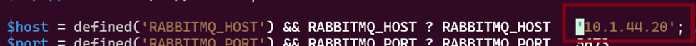

# NIMC M & E
Installation, Setup and Troubleshooting instructions:

1. Accessing the Server

2. [Installation of Server Dependencies](server%20installation.md)

3. Installation of App / Codebase
    * Clone m-and-e branch of github repo
        ```
        cd ~ && mkdir m-and-e
        cd ./m-and-e
        git clone -b m-and-e --single-branch https://github.com/Maybeach-Technologies-Limited/NDID4D-Website-and-Digital-Economy.git
        ```

    * Download latest codebase by running  
        ```
        cd ~
        cd ./m-and-e/ndid4d-dev
        git pull origin m-and-e
        ```
    
    * Setup docker dependcies & configuration  
        ```
        cd ~ && cd ./m-and-e/ && cp -a ./ndid4d-dev/docs/docker/* ./ && mkdir mysql_data && mkdir mysql_backup
        ```

    * Edit the content of `docker-compose.yml` to set the variables for the containers

    * If SSL Certificates are available, then copy them to the `nginx/ssl/.ssl-cert/` and modify the ssl block within `nginx/ssl/.ssl-cert/default.conf` file to set the variables for the certificates.

        ```
        upstream php {
            server unix:/tmp/php-cgi.socket;
            server backend:9000;
        }

        server {
            listen 80;
            server_name mande-docker.test;

            root /var/www/html;

            index index.php;
            client_max_body_size 60M;
            
            # Redirect HTTP to HTTPS
            # Uncomment the following line to enable HTTP to HTTPS redirection
            # return 301 https://$host$request_uri;

            location / {
                try_files $uri $uri/ /index.php?$args;
            }

            location ~ \.php$ {
                include fastcgi.conf;
                fastcgi_intercept_errors on;
                fastcgi_pass php;
            }

            location ~* \.(js|css|png|jpg|jpeg|gif|ico)$ {
                expires max;
                log_not_found off;
            }
        }

        server {
            listen 443 ssl;
            server_name mande-docker.test;
            
            root /var/www/html;

            index index.php;
            client_max_body_size 60M;

            # SSL Configuration
            ssl_certificate /home/ssl/.ssl-cert/ServerCertificate.crt;
            ssl_certificate_key /home/ssl/.ssl-cert/example.com.key;
            ssl_trusted_certificate /home/ssl/.ssl-cert/Intermediate.crt;

            location / {
                try_files $uri $uri/ /index.php?$args;
            }

            location ~ \.php$ {
                include fastcgi.conf;
                fastcgi_intercept_errors on;
                fastcgi_pass php;
            }

            location ~* \.(js|css|png|jpg|jpeg|gif|ico)$ {
                expires max;
                log_not_found off;
            }
        }
        ```

    * If SSL Certificates are not available, then remove the ssl block within `nginx/ssl/.ssl-cert/default.conf` file
        - Uncomment the `return 301 https://$host$request_uri;` line to disable HTTP to HTTPS redirection.

    * Edit the content of `ndid4d-dev/engine/plugins/nwp_queue/rabbit-mq/worker-linux.php` to set the IP variable for the RabbitMQ container (This is usually the IP Address of the host machine)
    

    * Launch docker containers
        ```
        sudo docker-compose up -d --build
        sudo docker-compose down && sudo docker-compose up -d
        ```

4. [Database Management](database%20management.md)

5. Application Configuration
    
    * Set Permissions to Web Directories
        ```
        cd ~ && cd ./m-and-e/
        sudo chmod -R 777 ./ndid4d-dev/engine/tmp
        sudo chmod -R 777 ./ndid4d-dev/engine/files
        ```

    * Create Temporary dump directory for bulk data loading operations
        ```
        cd ~ && cd ./m-and-e/ndid4d-dev/engine/tmp
        mkdir MySQLBulkLoad
        ```
   
    * [Enable Background Tasks](server%20installation.md#step-4-creating-supervisor-tasks)

9. Performing Code Update
    * Ensure there are no changes on the current code base  
    `cd ~ && cd ./m-and-e/ndid4d-dev && git status`

    * If changes exists, then clear it by running  
    `git rm <full filename>`

    * Download latest codebase by running  
        ```
        cd ~ && cd ./m-and-e/ndid4d-dev
        git pull origin m-and-e
        ```

10. [Troubleshooting](troubleshooting.md)
